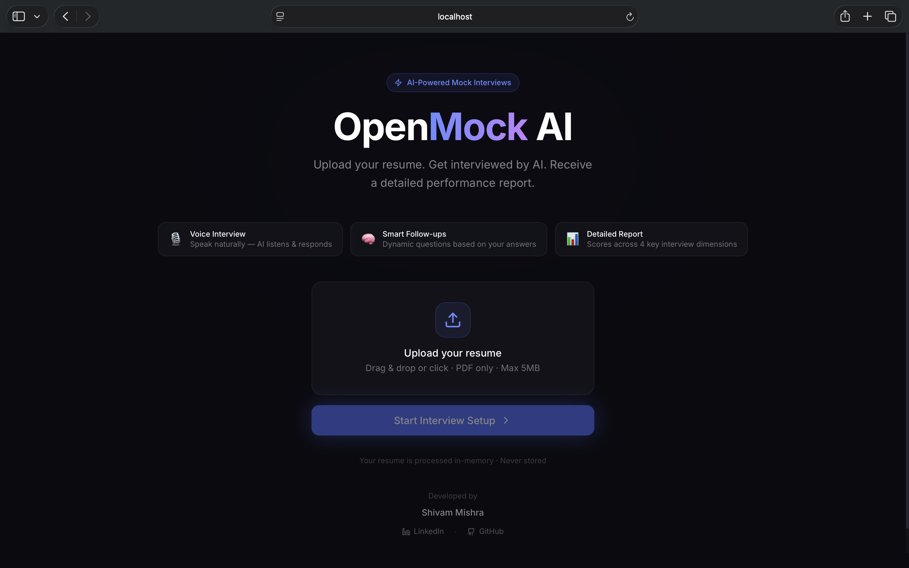
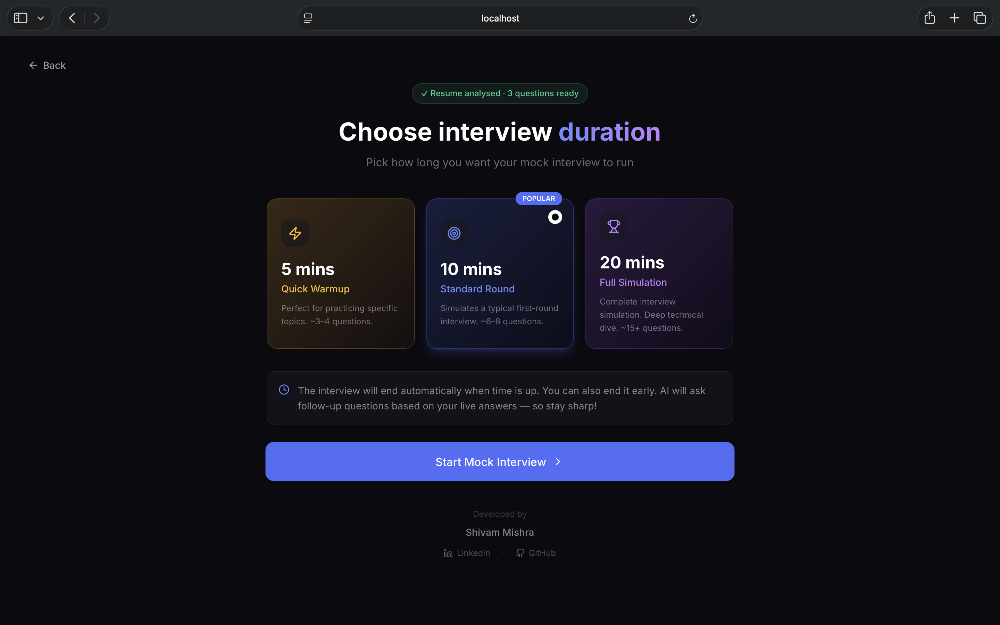
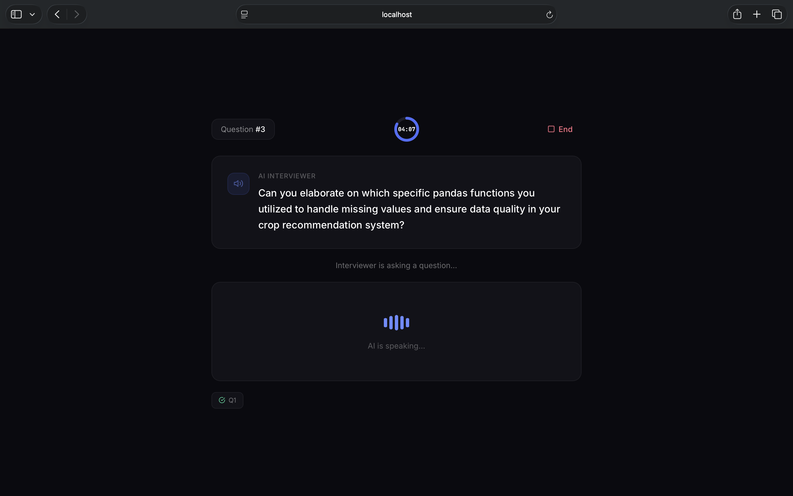
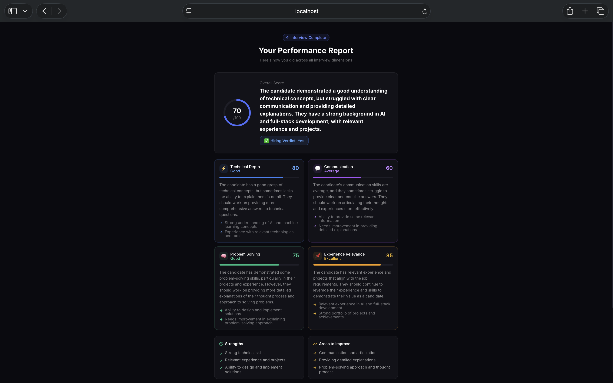

<div align="center">

# 🎙️ Open Mock AI

### Your Personal AI Interviewer — Speak. Answer. Improve.

[](YOUR_LIVE_LINK_HERE)
[](LICENSE)
[](https://nodejs.org)
[](https://react.dev)
[](https://groq.com)
[](https://vercel.com)

<br/>

> **Open Mock AI** is a full-stack AI-powered mock interview platform that simulates real technical interviews — complete with voice interaction, dynamic follow-up questions, and a detailed performance report.

<br/>

</div>

---

## 📸 Screenshots

<table>
  <tr>
    <td align="center" width="50%">
      
      <br/><b>🏠 Home — Resume Upload</b>
    </td>
    <td align="center" width="50%">
      
      <br/><b>⚙️ Setup — Choose Duration</b>
    </td>
  </tr>
  <tr>
    <td align="center" width="50%">
      
      <br/><b>🎙️ Live Interview — Voice Mode</b>
    </td>
    <td align="center" width="50%">
      
      <br/><b>📊 Report — Performance Feedback</b>
    </td>
  </tr>
</table>

---

## ✨ Features

- 🎙️ **Voice-First Interview** — Speak your answers naturally using your microphone. AI listens, understands, and responds with its own voice.
- 🧠 **Resume-Aware Questions** — Upload your PDF resume and get questions tailored specifically to your experience, projects, and tech stack.
- 🔁 **Dynamic Follow-ups** — AI doesn't just ask scripted questions. It analyses your answers in real time and asks intelligent follow-up questions.
- ⏱️ **Flexible Duration** — Choose between 5, 10, or 20-minute interview sessions based on your prep goals.
- 📊 **Detailed Feedback Report** — After the interview, get a comprehensive performance report scored across 4 dimensions:
  - ⚡ Technical Depth
  - 💬 Communication Clarity
  - 🧠 Problem Solving
  - 📌 Experience Relevance
- 🏆 **Overall Score + Hiring Verdict** — Know exactly where you stand with a score out of 100 and a hiring verdict.
- 🔒 **Zero Persistence** — Your resume and answers are never stored on any server. Everything runs in-memory.

---

## 🛠️ Tech Stack

| Layer | Technology |
|---|---|
| **Frontend** | React 18, Vite, Tailwind CSS, Framer Motion |
| **Backend** | Node.js, Express.js (Vercel Serverless Functions) |
| **AI / LLM** | Groq SDK — `llama-3.3-70b-versatile` |
| **Voice Input** | Web Speech API (browser-native, free) |
| **Voice Output** | SpeechSynthesis API (browser-native, free) |
| **Resume Parsing** | `pdf-parse` (Node.js) |
| **Monorepo** | Turborepo |
| **Deployment** | Vercel |

---

## 📁 Project Structure

```
open-mock-ai/
├── apps/
│   ├── frontend/                  # React + Vite app
│   │   └── src/
│   │       ├── pages/
│   │       │   ├── Home.jsx       # Landing + resume upload
│   │       │   ├── Setup.jsx      # Duration picker
│   │       │   ├── Interview.jsx  # Live voice interview
│   │       │   └── Report.jsx     # Feedback report
│   │       ├── hooks/
│   │       │   ├── useSpeech.js   # Web Speech API (STT + TTS)
│   │       │   └── useTimer.js    # Interview countdown timer
│   │       ├── components/
│   │       │   └── Footer.jsx
│   │       └── lib/
│   │           └── api.js         # Axios calls to backend
│   │
│   └── backend/                   # Express + Vercel Serverless
│       ├── api/index.js           # App entry point
│       ├── routes/
│       │   ├── parse.js           # POST /api/parse
│       │   ├── interview.js       # POST /api/interview
│       │   └── feedback.js        # POST /api/feedback
│       └── services/
│           ├── groqService.js     # All Groq AI calls
│           └── resumeService.js   # PDF text extraction
│
├── packages/
│   └── shared/                    # Shared constants
├── turbo.json
├── vercel.json
└── package.json
```

---

## 🚀 Getting Started

### Prerequisites

- Node.js `v18+`
- A free [Groq API Key](https://console.groq.com) — takes 30 seconds to get
- Chrome browser (required for Web Speech API)

### 1. Clone the repo

```bash
git clone https://github.com/shivamishra-02/open-mock-ai.git
cd open-mock-ai
```

### 2. Install dependencies

```bash
npm install
```

### 3. Set up environment variables

```bash
# Create the backend .env file
cp apps/backend/.env.example apps/backend/.env
```

Open `apps/backend/.env` and add your Groq API key:

```env
GROQ_API_KEY=your_groq_api_key_here
```

### 4. Run locally

```bash
npm run dev
```

| Service | URL |
|---|---|
| Frontend | http://localhost:3000 |
| Backend | http://localhost:4000 |
| Health Check | http://localhost:4000/api/health |

---

## 🔄 How It Works

```
1. Upload Resume (PDF)
        ↓
2. AI parses resume + generates opening questions + interview intro
        ↓
3. Choose interview duration (5 / 10 / 20 mins)
        ↓
4. 3-2-1 countdown → AI speaks intro (voice)
        ↓
5. AI speaks Question → You click "Start Answer" → Speak → "Stop Recording"
        ↓
6. AI analyses your answer → generates intelligent follow-up question
        ↓
7. Repeat until time runs out or you end the interview
        ↓
8. Full feedback report generated with scores + verdict
```

---

## 📡 API Endpoints

| Method | Endpoint | Description |
|---|---|---|
| `POST` | `/api/parse` | Upload resume PDF → returns extracted text + questions + intro |
| `POST` | `/api/interview` | Send answer → returns next follow-up question |
| `POST` | `/api/feedback` | Send full transcript → returns detailed feedback report |
| `GET` | `/api/health` | Server health check |

---

## 🌐 Deployment

This project is configured for **one-click deployment on Vercel**.

> 📖 Full step-by-step deployment guide coming soon — will be updated when the live link is added.

---

## 🤝 Contributing

Pull requests are welcome! For major changes, please open an issue first.

1. Fork the repo
2. Create your branch: `git checkout -b feature/your-feature`
3. Commit: `git commit -m 'Add some feature'`
4. Push: `git push origin feature/your-feature`
5. Open a Pull Request

---

## 📄 License

This project is licensed under the **MIT License** — see the [LICENSE](LICENSE) file for details.

---

<div align="center">

**Built with ❤️ by [Shivam Mishra](https://www.linkedin.com/in/shivam-mishra-3a741b253/)**

[](https://www.linkedin.com/in/shivam-mishra-3a741b253/)
[](https://github.com/shivamishra-02)

<br/>

*If you found this project useful, please consider giving it a ⭐ — it means a lot!*

</div>